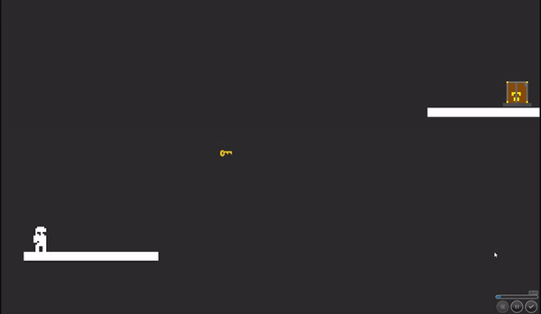

# Reality Check

A puzzle game where you have to utilize your ability to travel between the reality and the nightmare dimension to solve levels.

Beware of the dangers the nightmare dimension might throw at you !

## [PLAY IN YOUR BROWSER](https://reality-check-junction2018.herokuapp.com)

 Made by [ErkHal](https://github.com/ErkHal), [Makkelip](https://github.com/Makkelip) and [MikkoUusimaa](https://github.com/MikkoUusimaa) at the Junction 2018 Game Jam Challenge

### Requirements

[Node.js](https://nodejs.org) to install and run scripts.

## Install and run

Run next commands in your terminal:

| Command | Description |
|---------|-------------|
| `npm install` | Install dependencies (run this one before doing anything else !)|
| `npm start` | Launch browser to view the game   Press `Ctrl + c` to kill **http-server** process. |

### Development notes

* Each of the levels should contain their own logic for collectables and enemies
* The rendered level platforms are separated in to their own json files, located in the levelPlatforms folder.
 One entry inside a dimension array contains the X, Y and the scale of the sprite to be rendered